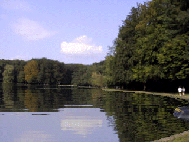



## Advanced Graphics Routines 3\.3 UPDATED

### Description

Advanced Graphics Routines 3.3 + + +

New Additions:

- Monochrome Filter

- some really cool metallic effects

- 2 great psychodelic effects, check them out!

- wave filter (see Screenshot-animation)

+ + +

This is an updated version of the Advanced Graphics Routines 3.0, which already won the contest twice, and I think that's enough. So please do me the favor and do NOT vote for this posting! If you like the code, then vote for Version 3.2 (Contest Winner March 2001), you find it here: + + +

http://www.planet-source-code.com/xq/ASP/txtCodeId.21470/lngWId.1/qx/vb/scripts/ShowCode.htm

+ + +

And make sure to try the Project 'WaveDemo.vbp', it is really realistic and beautiful, and realtime.

+ + +

For more Information on the entire posting see the previous Version 3.2, link above.

+ + +

Sincerely, Florian Egel

+ + +

PS: I know, I ignored the email requests for the source code of the last months and I am really sorry about it, but I was very busy and I had almost no time to go online. I now uploaded the sources to my Homepage, you find them under http://www.flomix.de/download/foxcbmp_src.zip

+ + +

PPS: Once again: PLEASE DON'T VOTE this version, vote the previous version instead. Thanks.

+ + +
 
### More Info
 

             |
---                |---
**Submitted On**   |2001-04-07 15:33:38
**By**             |[Florian Egel](https://github.com/Planet-Source-Code/PSCIndex/blob/master/ByAuthor/florian-egel.md)
**Level**          |Intermediate
**User Rating**    |5.0 (85 globes from 17 users)
**Compatibility**  |VB 4\.0 \(32\-bit\), VB 5\.0, VB 6\.0
**Category**       |[Graphics](https://github.com/Planet-Source-Code/PSCIndex/blob/master/ByCategory/graphics__1-46.md)
**World**          |[Visual Basic](https://github.com/Planet-Source-Code/PSCIndex/blob/master/ByWorld/visual-basic.md)
**Archive File**   |[Advanced G18050472001\.zip](https://github.com/Planet-Source-Code/florian-egel-advanced-graphics-routines-3-3-updated__1-22174/archive/master.zip)

